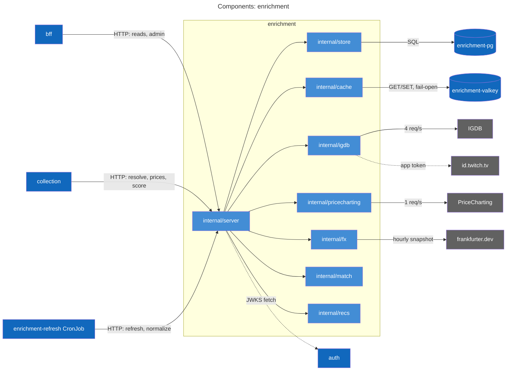
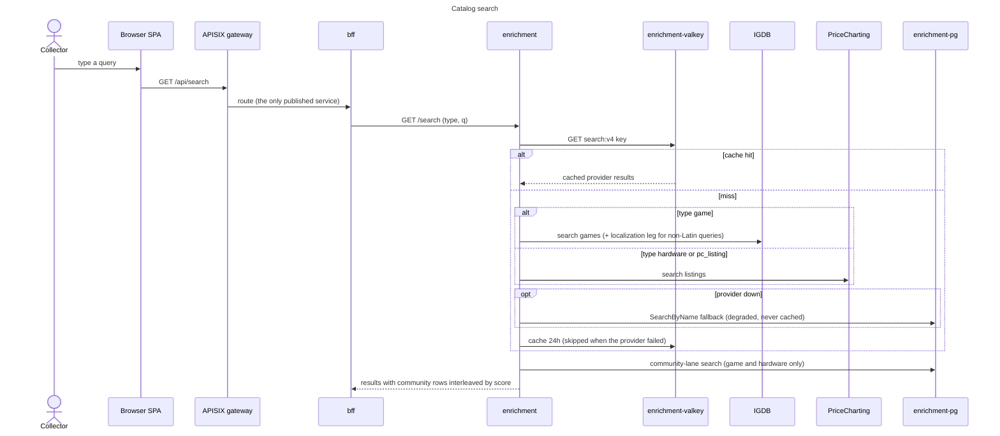
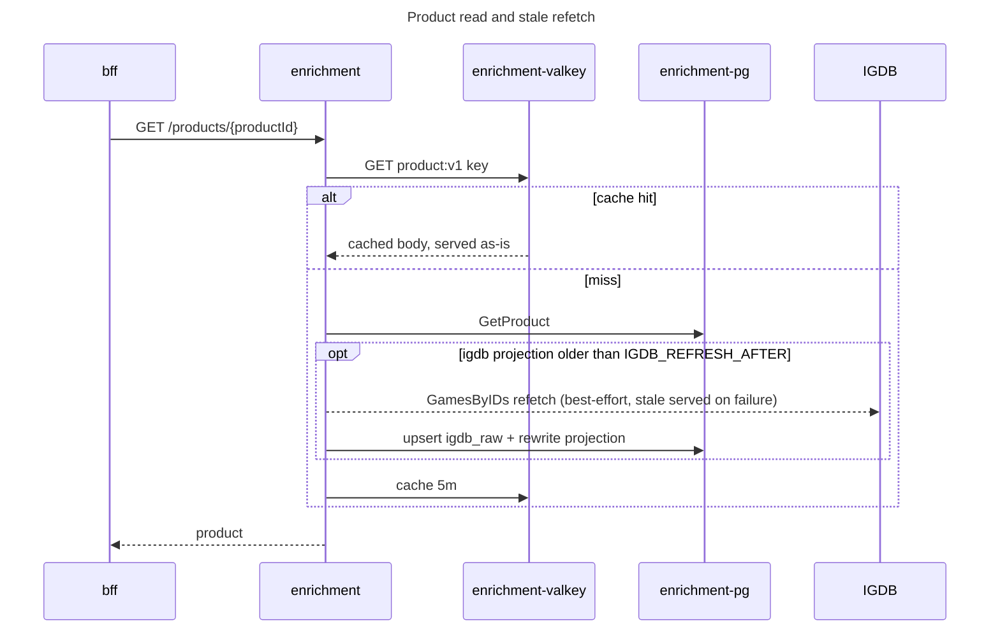
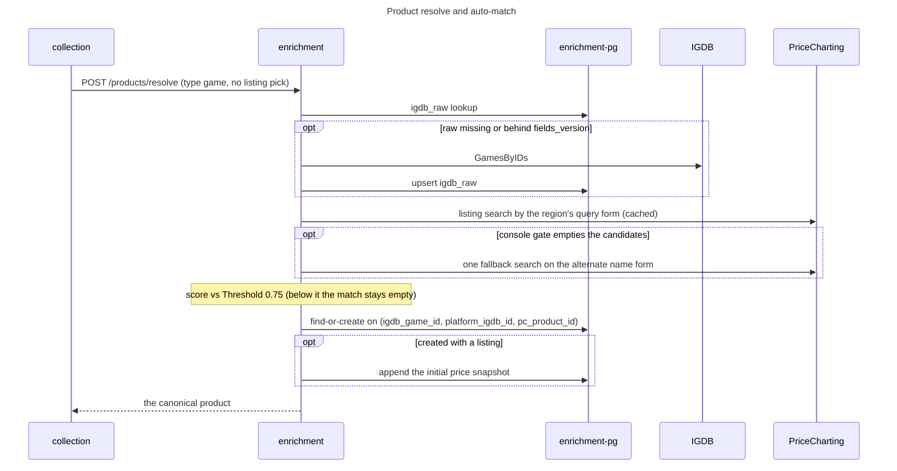
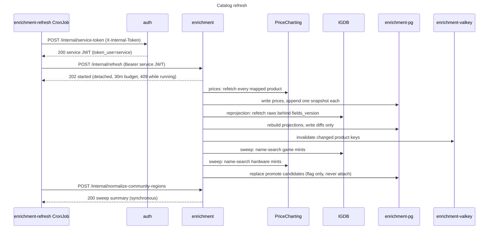
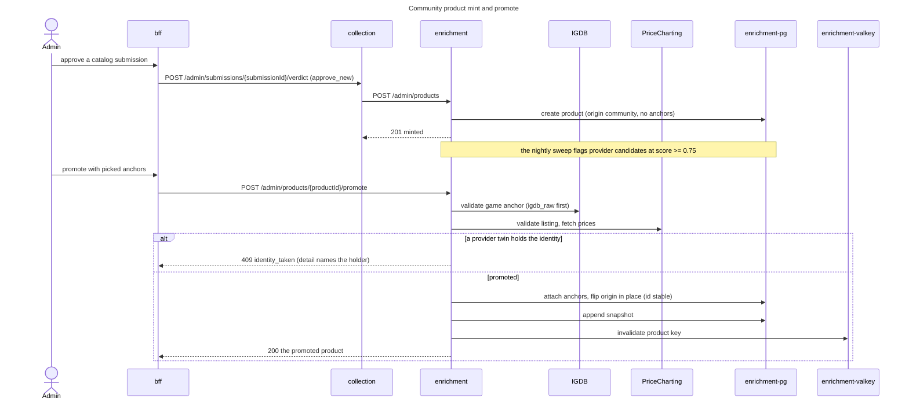
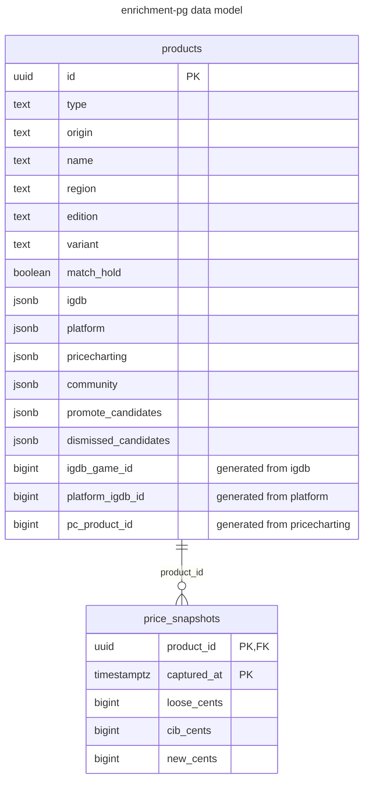

# enrichment service

## Purpose and boundaries

All third-party data enters vgkeep here and nowhere else. The data providers sit behind this service: IGDB game
metadata (`api.igdb.com/v4`, app token minted at `id.twitch.tv/oauth2/token`, client-side limiter at 4 req/s),
PriceCharting market prices (`www.pricecharting.com`, 1 req/s), and frankfurter.dev exchange rates
(`api.frankfurter.dev`, credential-less). Each provider client pairs with a fixture-backed stub selected by
`IGDB_MODE` / `PRICECHARTING_MODE` / `FX_MODE`, so a credential-less checkout runs the full feature set.

The service owns product catalog identity (find-or-create, provider-mapped or community-minted), auto-match scoring
between IGDB games and PriceCharting listings (`match.Threshold` 0.75; below it a product lands unmatched, never
guessed), the daily price-snapshot series per product, the platform catalog, and the moderation surface for community
products. It refuses to own user data: recommendation scoring is user-agnostic and the caller sends the library with
every request. It also cannot see entries; the bff verifies that no entries reference a product before asking for a
delete.

Callers are the bff and the collection service (both reach it via their `ENRICHMENT_SERVICE_URL`) plus the
enrichment-refresh CronJob. The NetworkPolicy `enrichment-from-callers-only` admits exactly those pod selectors
on port 8080; the APISIX gateway publishes only the bff and never routes here. Outbound, the service talks to the
the data providers and fetches JWKS from auth (`JWKS_URL`), nothing else.

## API surface

[api/enrichment.yaml](../../api/enrichment.yaml) is the authority for every schema. All routes sit behind a blanket
Bearer JWT validated against auth's JWKS; the guards named below come on top of it. Errors are problem+json with
stable codes declared per operation (`invalid_param`, `product_not_found`, `identity_taken`, `product_matched`,
`refresh_in_progress`, `upstream_unavailable` among them); request bodies cap at 256 KiB. `/healthz` and `/readyz`
live outside the JWT boundary, and readiness is a Postgres ping only, because the cache fails open per-request.

User-facing reads, called through the bff:

| Route | What it answers |
| --- | --- |
| `GET /search` | Discovery search by `type` (game / hardware / pc_listing), physical-only for games; `degraded: true` marks a provider-down local fallback |
| `GET /products/{productId}` | One product, read-through cached, with inline best-effort refetch of stale IGDB projections |
| `GET /platforms` | The IGDB platform catalog minus digital-only platforms, joined with alias knowledge, for pickers and the normalize lever |
| `GET /fx/latest` | USD-based exchange-rate snapshot from frankfurter.dev |

Shared with the collection service:

| Route | What it answers |
| --- | --- |
| `POST /products/resolve` | Find-or-create the canonical product for a search selection (idempotent) |
| `POST /products/prices:batch` | Current prices for up to 500 product ids |
| `POST /products/price-history:batch` | Snapshot series for up to 500 ids inside a 1-365 day window |
| `POST /recommendations:score` | Ranked unowned games against a caller-supplied library (up to 2500 entries, limit max 50) |

Machine triggers (the gateway never routes them):

| Route | Guard | What it does |
| --- | --- | --- |
| `POST /internal/refresh` | service token (`token_use=service`) | Starts the catalog refresh, answers 202, one run at a time |
| `POST /internal/normalize-community-regions` | admin role or service token | Folds free-text community regions into the known set, synchronously |

Moderation, admin role required:

| Route | What it does |
| --- | --- |
| `POST /admin/refresh` | The operator's immediate-refresh trigger (202; 409 `refresh_in_progress` while one runs) |
| `POST /admin/products` | Mint an anchor-less community product from an approved submission |
| `PUT /admin/products/{productId}/pricecharting` | Correct or clear a listing mapping, verified, snapshot appended |
| `POST /admin/products/{productId}/promote` | Flip a community product to provider identity in place |
| `GET /admin/products/promote-candidates` | The flag-never-act sweep's worklist (`limit` 1-500 default 200, `offset`, `total_count`) |
| `POST /admin/products/{productId}/promote-candidates/dismiss` | Silence one (provider, provider_id) pair permanently |
| `DELETE /admin/products/{productId}` | Remove an unmatched product and its snapshots |
| `GET /admin/products/unmatched` | Every product without a listing mapping, held ones included; same paging |
| `GET /admin/products/community` | Every un-promoted community product; same paging |

## Components

Components are the `internal/` packages. `internal/match` and `internal/recs` are pure (no I/O); everything else
fans out from `internal/server`, which implements the generated `ServerInterface` and holds the JWT guards, the
refresh runner, and the domain metrics.

`internal/store` is the only package that queries the schema; `internal/cache` returns Valkey errors verbatim and
every handler treats them as a miss (logged and counted, never fatal).

## Actor flows

The flows decided in this service are drawn here. For the rest it is one hop among several: entry add end to
end and pricing reads live with the collection service
([services/collection/README.md](../collection/README.md); the legs here are `POST /products/resolve`,
`POST /products/prices:batch`, `POST /products/price-history:batch`), recommendations composition and the guarded
product delete live with the bff ([services/bff/README.md](../bff/README.md); the legs here are
`POST /recommendations:score` and `DELETE /admin/products/{productId}`), the 07:00 entry rematch chain lives with
the collection service (rematch re-calls `POST /products/resolve`), and sign-in, sessions and account deletion never
touch this service at all: it holds no user data and has no purge leg.

### Catalog search

Cache-first, never DB-first (the local catalog is incomplete by construction). The provider is picked by kind: game
searches hit IGDB, with a supplementary localization leg for non-Latin queries; hardware and pc_listing searches hit
PriceCharting. A provider failure over a cold cache degrades to a local Postgres name match, flagged and never
cached. Community products interleave after cache resolution, scored by the same name similarity, so the cached body
stays provider-only and a fresh mint appears immediately.

Game results are physical-only. The IGDB queries exclude the digital-only game types (DLC, mods, episodes, seasons,
forks, packs, updates), and the digital-only platforms listed in `api/domain.yaml` drop off each result's platform
list, taking the game with them when none remain. The same platform list gates game resolves and the platform
catalog. IGDB carries no per-game physical flag, so PC-only digital titles still surface.

### Product read and stale refetch

`GET /products/{productId}` reads through Valkey (5 minutes) to Postgres. A product whose IGDB projection is older
than `IGDB_REFRESH_AFTER` is refetched inline, best-effort: the raw payload and projection are rewritten on success,
and the stale copy is served on any provider failure. Prices never refresh per-read; that is the catalog refresh's
job.

### Product resolve and auto-match

The enrichment-owned leg of adding an entry. Game identity is listing-keyed, so the listing is picked before the
find-or-create lookup: a caller-supplied `pc_product_id` is fetched exactly (manual match), and a no-pick resolve
runs the auto-matcher. Raw payload reuse comes first: an `igdb_raw` row at the current fields version answers
without a provider call. The entry region steers matching only (it never joins identity): the console gate admits
only consoles acceptable for the region class, and an ntsc_j resolve queries PriceCharting by the ja-JP
transliteration when the catalog carries one, with one fallback search on the alternate name form when the gate
empties the first candidate set. A best score under 0.75 creates the unmatched member instead. The region
extension checklist is [docs/adding-a-region.md](../../docs/adding-a-region.md).

### Catalog refresh

The CronJob first authenticates: it presents the shared internal secret to auth, then triggers the refresh
with the minted service token as a plain Bearer call. The refresh answers 202 and detaches with a 30
minute budget (a concurrent trigger answers 409), then runs its steps: prices plus one snapshot per mapped
product, a diff-gated reprojection of every IGDB-bearing product (refetching only raws behind the current
`fields_version`), and the flag-never-act promote-candidate sweep. The same job then runs the region normalize
synchronously. The wire-level triage view of this flow, curl exit codes included, is in the runbook's
[Architecture](../../docs/runbooks/enrichment.md#architecture) and
[Failure modes](../../docs/runbooks/enrichment.md#failure-modes-and-triage) sections.

### Community product mint and promote

The collection service's [README](../collection/README.md) owns the submission queue and verdict; this is the leg
after an admin approves. Minting creates an anchor-less product (origin `community`, no IGDB, no PriceCharting)
whose curated name is its identity. Promotion validates the picked provider anchors and flips origin in place: the
product id stays stable, so every adopter's entry upgrades through live reads with no repointing. The identity
index adjudicates twins; a 409 `identity_taken` names the holding product, and the community product keeps working
unpromoted. Dismissed candidate pairs never re-flag.

## Data model

One migration (`migrations/000001_schema.up.sql`) creates the whole schema. The diagram carries the one real
relationship; `igdb_raw` and `platforms` are standalone caches described below.

What the diagram cannot say:

- The identity columns are `GENERATED ALWAYS AS ... STORED` off the jsonb subdocs, so the identity indexes are plain
  btrees over scalars. Unique partial indexes carry identity: `products_game_identity` on `(igdb_game_id,
  platform_igdb_id, pc_product_id) NULLS NOT DISTINCT` where `type = 'game' AND origin = 'provider'`;
  `products_hardware_identity` on `(pc_product_id, region, edition, variant) NULLS NOT DISTINCT` where
  `type IN ('console', 'accessory') AND origin = 'provider'`; `products_pc_listing_identity` on `(pc_product_id)`
  where `type = 'pc_listing'` (unscoped by origin). `NULLS NOT DISTINCT` makes the unmatched member (null listing)
  a real, unique family slot. Community products sit outside the origin-scoped indexes on purpose; promote re-enters
  them through the index, which is what adjudicates twins. Support indexes: `products_name` (degraded search) and
  the partial `products_unmatched_worklist` on `(updated_at, id)` where `origin = 'provider' AND pricecharting IS
  NULL`.
- `price_snapshots` is range-partitioned on `captured_at`, one partition per year 2026 through 2036 plus
  `price_snapshots_default`; the primary key is `(product_id, captured_at)` and the FK cascades on delete, so an
  admin product delete drops the series with it.
- `igdb_raw` (`id`, `game` jsonb, `fetched_at`, `fields_version`) is the shared raw-payload cache: every provider
  fetch writes it back, and resolve, reprojection and recommendations read it before calling IGDB. A row behind
  `store.RawFieldsVersion` (currently 2) is refetched on next use.
- `platforms` (`igdb_id`, `name`, `abbreviation`, `generation`, `logo_url`, `fetched_at`) holds the wholesale IGDB
  platform catalog; staleness rides the same `IGDB_REFRESH_AFTER` horizon.

Valkey keyspace (`internal/cache`): `search:v4:<kind>:<hex sha256 of the normalized query>` at `SEARCH_CACHE_TTL`
(24h), `product:v1:<uuid>` at `PRODUCT_CACHE_TTL` (5m), and the single wholesale key `platforms:v1` at the search
TTL. Valkey is a pure cache: startup requires it (deploy ordering), every runtime call fails open, and a restart
starts cold.

## Internal layout

- `cmd/enrichment`: one binary. `enrichment` serves; `enrichment migrate` loads the full config, runs the
  embedded migrations via `pgkit.Migrate`, and exits (the deployment runs it as the `migrate` init container).
- `internal/server`: the generated `ServerInterface` implementation. Handlers split by domain
  (`handlers_search.go`, `handlers_products.go`, `handlers_pricing.go`, `handlers_platforms.go`,
  `handlers_recommendations.go`, `handlers_community.go`, `handlers_admin.go`) around `server.go` (interfaces,
  `Handlers`, guards, metrics), `routes.go`, and `regions.go` (`regionQueryChains`).
- `internal/store`: all SQL; no other package queries the schema. Sentinels `ErrNotFound` and `ErrIdentityTaken`.
- `internal/cache`: the Valkey surface; key formats and version segments live here, fail-open decisions stay with
  the callers.
- `internal/igdb`, `internal/pricecharting`, `internal/fx`: one real client and one fixture-backed stub each.
  `internal/igdb` also owns the region tables (`BundleLocalizations`, `altTagFamilies`); `internal/fx` keeps an
  hourly in-memory snapshot and serves stale on refetch failure.
- `internal/match`: pure scoring (`Threshold`, console alias and region acceptance tables). `internal/recs`: pure
  recommendation scoring over the caller's library.
- `internal/config`: the env contract. `internal/gen/api/server.gen.go` is generated from the contract; everything
  else is authored. `migrations/migrations.go` embeds the SQL.

## Configuration

From `internal/config/config.go`; defaults are the code's. The runbook's Configuration section documents the full
wiring path (.env through ExternalSecret to pod env) and the chart-composed `DATABASE_URL`.

| Env var | Default | What it does |
| --- | --- | --- |
| `HTTP_ADDR` | `:8080` | Listen address |
| `DATABASE_URL` | required | Postgres URL (TLS via `sslmode`/`sslrootcert` params) |
| `VALKEY_URL` | required | Valkey URL |
| `VALKEY_CA_FILE` | unset | CA bundle; config refuses a `rediss://` URL without it |
| `JWKS_URL` | required | auth's JWKS endpoint for JWT validation |
| `JWT_ISSUER` / `JWT_AUDIENCE` | `vgkeep-auth` / `vgkeep` | Expected token claims |
| `IGDB_MODE` | `stub` | `real` requires `IGDB_CLIENT_ID` and `IGDB_CLIENT_SECRET`, refused at load otherwise |
| `PRICECHARTING_MODE` | `stub` | `real` requires `PRICECHARTING_API_KEY`, refused at load otherwise |
| `FX_MODE` | `stub` | frankfurter.dev needs no credentials; the chart default is `real` |
| `SEARCH_CACHE_TTL` | `24h` | Search and platform-catalog cache TTL |
| `PRODUCT_CACHE_TTL` | `5m` | Product read cache TTL |
| `IGDB_REFRESH_AFTER` | `720h` | IGDB projection and platform-catalog staleness horizon |
| `SERVICE_VERSION` | `dev` | Stamped on telemetry as `service.version` |

Secrets arrive by ExternalSecret. `enrichment-secrets` carries `igdb-client-id`, `igdb-client-secret` and
`pricecharting-api-key` (each materialized only in real mode) plus `internal-service-token`, which the CronJob
consumes for its auth exchange; the service itself never reads it. The Postgres password rides
`enrichment-pg-credentials` key `password`. `OTEL_EXPORTER_OTLP_ENDPOINT` is set by the chart and read by the shared
OTel setup, not `internal/config`; empty disables export.

## Development

The root Taskfile includes this service's tasks under the `enrichment:` namespace: `task enrichment:gen` regenerates
`internal/gen/api` from the contract, `task enrichment:db:migrate` runs migrations against `DATABASE_URL`, and the
root `task migrate` runs every migrate-capable service's migrations. Shared commands (stack up, lint, test, e2e) are
in the root [README](../../README.md).

Under Tilt the pod forwards to `localhost:8084` (container 8080) and `enrichment-pg` to `localhost:5437`. There is
no gateway route, so direct calls to 8084 need a JWT; `task grant-fixture-admin` gives the dev `admin` fixture the
admin role. Ready-made requests for all of this live in `bruno/enrichment/` (15 requests: search, resolve, reads,
batch prices and history, recommendations, and the admin levers).

Store, cache and handler integration tests run against real datastores through the `libs/go/pgtest` and
`libs/go/valkeytest` kits, which adopt the shared test containers the root `task test` starts (or boot their own);
`go test -short` skips them.

## See also

- [api/enrichment.yaml](../../api/enrichment.yaml): the contract.
- [docs/runbooks/enrichment.md](../../docs/runbooks/enrichment.md): the operator's view; alerts, dashboard panels,
  telemetry inventory, failure modes, admin lever recipes, capacity.
- [deploy/observability/dashboards/enrichment.yaml](../../deploy/observability/dashboards/enrichment.yaml): source
  for the vg-enrichment dashboard.
- [deploy/charts/enrichment/](../../deploy/charts/enrichment/): the Helm chart (service, datastores, CronJob,
  NetworkPolicy, ExternalSecrets).
- [docs/architecture.md](../../docs/architecture.md): the system view; context and container diagrams, the
  end-to-end flows, datastore boundaries, deployment topology.
